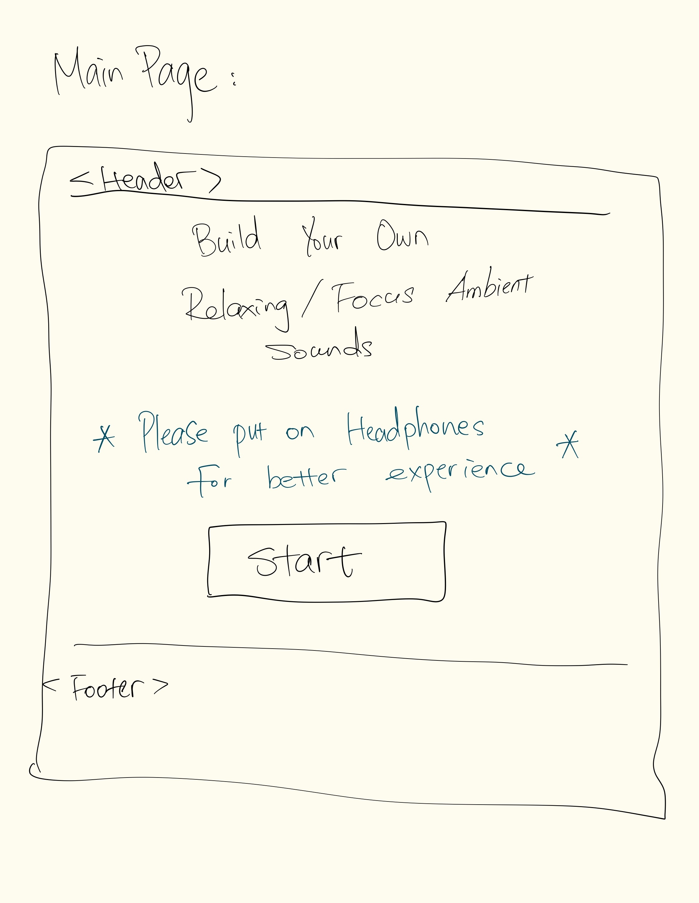
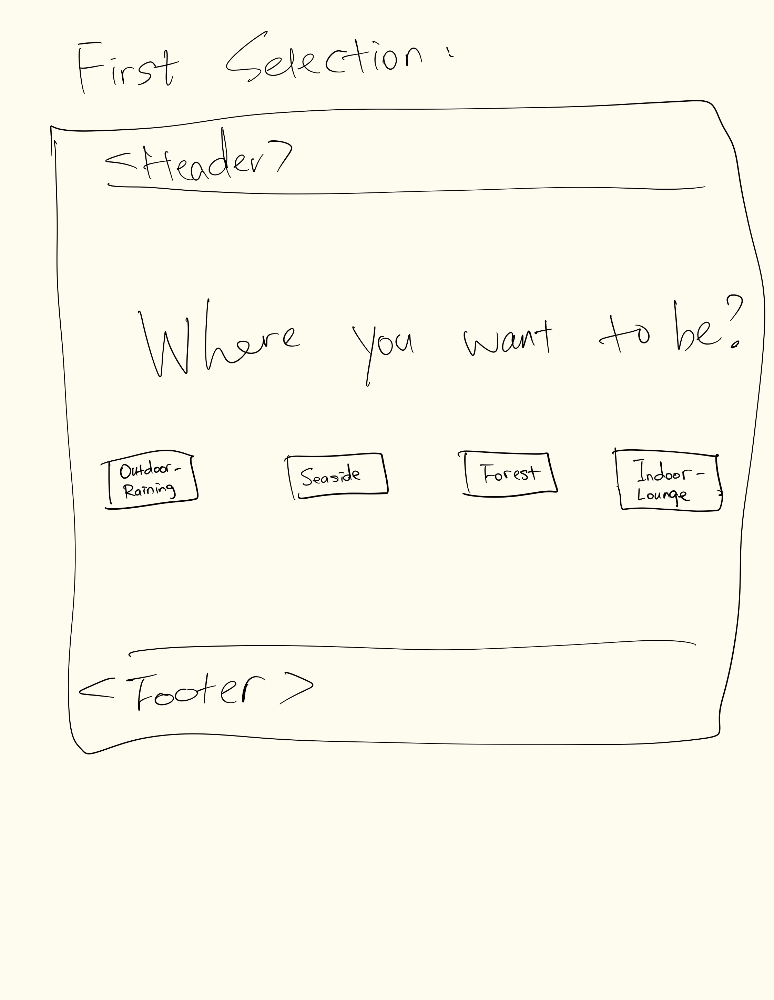
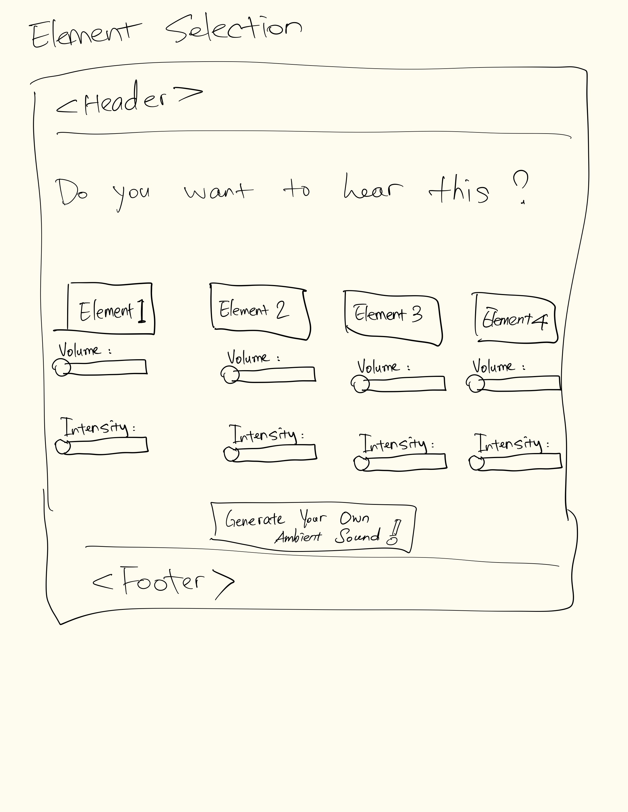

# # Project Title

**ZenTunes**: Personalized Soundscapes for Relaxation and Focus

## Overview

ZenTunes is a interactive React JS application designed to allow users to create their own personalized ambient soundscapes. By selecting an environment and adding sound elements, users can tailor the ambiance to enhance relaxation or concentration.

### Problem

In today’s fast-paced world, finding the right ambient sounds for relaxation or focus can be a time-consuming task. There is a need for a customizable solution that allows individuals to quickly and easily craft an auditory environment that suits their needs.

### User Profile

The primary users of this application are individuals seeking to enhance their work or relaxation environments. Users can interactively choose and modify sound elements to create a soundscape that fits their personal preference or mood.

### Features

- Environment Selection: Users can choose from various ambient environments like rain, seaside, forest, and indoors.
- Hover to preview: on the selection, when user hover on the selection button, the preview sound will paly and website turns to a dynamic background.
- Sound Element Customization: Each environment comes with unique sound elements that users can add to their mix.

## Implementation

### Tech Stack

- Frontend: React JS
- Audio Library: howler.js

### APIs

No external data APIs are used currently; all functionalities are implemented using internal logic and the howler.js library.

### Sitemap

1.  Home Page
    - With Title, message for headphone suggestion, and a button to start/navigate to First Selection Page.
2.  First Selection Page
    - Allows users to select their desired ambient environment.
3.  Element Selection Page
    - Users can interact with elements by playing/pausing their sounds and adjusting the volume and frequency via sliders. Selected elements can be combined to form a final mix.
4.  Results Page:
    - Displays the generated ambient soundscape with a progress bar and simple audio controls. A "Try Again" button for user to go back to Home Page.

### Mockups

#### Home Page

#### First Selection Page

- if user hover on the selection, the preview sound will play and change the background to a dynamic video
  

#### Element Selection Page

- the preview will has the same funcionality as in Firest Selection Page.
- the volume and frequency(intensity) sliders will show up if users click on the each element.
  

#### Results Page

### Data

Ambient Sound Categories:

1. Outdoor-Raining:

- Thunder
- Windchime
- Bamboo fountain
- Traffic

2. Seaside:

- Seagull
- Bonfire
- Boat
- Human activity

3. Forest:

- Birds
- Bugs
- Deer and other animals
- Creeks

4. Indoor-Lounge:

- Fireplace
- Pages turning
- Keyboard typing
- Clock ticking (TBD)
- Pets (cats or dogs) (TBD)

### Endpoints

No external endpoints; all functionalities are managed within the frontend application using React state and context.

### Auth

Currently, the project does not include any user authentication or profiles.

## Roadmap

- Sound Asset Preparation

  - Acquire and edit sound files for consistent volume and format.

- Video Asset Acquisition

  - Source and optimize video clips for dynamic backgrounds.

- Home Page Development

  - Design and implement the main page with interactive elements.

- First Selection Page Development

  - Develop interactive selection functionality with dynamic video backgrounds.

- Element Selection Page Development

  - Create controls for sound element customization including volume and frequency adjustments.

- Results Page Development

  - Create Audio Player with controls for generated result audio.

- Testing and Bug Fixes

  - Conduct comprehensive testing across all functionalities, addressing any issues identified.

## Nice-to-haves

- **Adjustable Settings**: Users can adjust the volume and frequency of each sound element via sliders.
- **Session Timer**: A timer to alert users to take breaks after a predetermined period of playback.
- **Music Upload and Integration**: Users can upload their music files or integrate with the SoundCloud API to enhance their ambient mix with music.
- **User Profiles**: Allowing users to save and share their custom soundscapes.
- **Responsive**: Now because of the hover, this app is desktop exclusive, may explore on other screen size.
