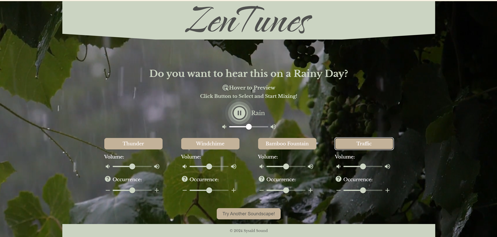

# ZenTunes: Personalized Soundscapes for Relaxation and Focus

<a id="readme-top"></a>

<!-- PROJECT LOGO -->
<br />
<div align="center">
  <a href="https://github.com/Samantha1047/ZenTunes-capstone">
    
  </a>

<h3 align="center">ZenTunes</h3>

  <p align="center">
    Personalized Soundscapes for Relaxation and Focus

<!-- TABLE OF CONTENTS -->
<details>
  <summary>Table of Contents</summary>
  <ol>
    <li>
      <a href="#about-the-project">About The Project</a>
      <ul>
      <li><a href="#Features">Features</a></li>
        <li><a href="#built-with">Built With</a></li>  
      </ul>
    </li>
    <li>
      <a href="#getting-started">Getting Started</a>
      <ul>
        <li><a href="#installation">Installation</a></li>
      </ul>
    </li>
    <li><a href="#contact">Contact</a></li>
    <li><a href="#acknowledgments">Acknowledgments</a></li>
  </ol>
</details>

<!-- ABOUT THE PROJECT -->

## About The Project


_A screenshot for Rainy ouutddor environment mixing page._

ZenTunes is a interactive React JS application designed to allow users to create their own personalized ambient soundscapes. By selecting an environment and adding sound elements, users can do real time mixing to tailor the ambiance to enhance relaxation or concentration.

<p align="right">(<a href="#readme-top">back to top</a>)</p>

### Features

- **Environment Selection:** Users can choose from various ambient environments like rainy outdoor, seaside, forest, and indoors.

- **Hover to preview:** When users hover over the selection button, the preview sound will play, and the website will switch to a dynamic background.

- **Sound Element Customization:** Each environment comes with unique sound elements that users can add to their mix, and each element has variations.

- **Real Time Mixing:** Users have individual control over the base layer ambient sounds and element sounds, allowing real-time mixing to find the best sound they want.

- **Loop Forever if Needed:** Users can leave the page open to continuously hear the sound. They don't need to worry about the soundtrack running out; it's always there for you!

### Built With

- [React.js]
- [Howler.js]

<p align="right">(<a href="#readme-top">back to top</a>)</p>

<!-- GETTING STARTED -->

## Installation

Follow these steps to run a local instance of ZenTunes:

1.  Clone or download this repo.

2.  Install NPM packages
    ```sh
    npm install
    ```
3.  Start the React app:
    ```sh
    npm run dev
    ```
4.  Click on the generated local url on the terminal:
    ```sh
    ➜  Local:   http://localhost:51xx/
    ```

<p align="right">(<a href="#readme-top">back to top</a>)</p>

<!-- LICENSE -->

## License

Distributed under the MIT License. See `LICENSE.txt` for more information.

<p align="right">(<a href="#readme-top">back to top</a>)</p>

<!-- CONTACT -->

## Contact

Samantha Sun - Sysald Sound
sysaldsound@gmail.com
[![LinkedIn][linkedin-shield]][linkedin-url]

<p align="right">(<a href="#readme-top">back to top</a>)</p>

<!-- ACKNOWLEDGMENTS -->

## Acknowledgments

- All the videos are from [pexels.com]

<p align="right">(<a href="#readme-top">back to top</a>)</p>

<!-- MARKDOWN LINKS & IMAGES -->

[linkedin-shield]: https://img.shields.io/badge/-LinkedIn-black.svg?style=for-the-badge&logo=linkedin&colorB=555
[linkedin-url]: https://linkedin.com/in/sysaldsound
[React.js]: https://reactjs.org/
[Howler.js]: https://howlerjs.com/
[pexels.com]: https://www.pexels.com/
