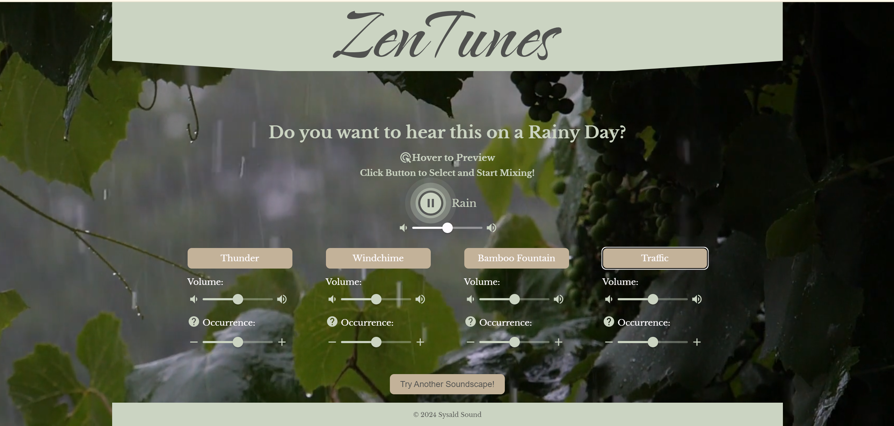

# ZenTunes: <br> Personalized Soundscapes for Relaxation and Focus

<!-- ABOUT THE PROJECT -->

## About The Project

**ZenTunes** is an interactive React JS application designed to allow users to create their own personalized ambient soundscapes. By selecting an environment and adding sound elements, users can do real-time mixing to tailor the ambiance to enhance relaxation or concentration.


_A screenshot of the Rainy outdoor environment mixing page._


### Features

- **Environment Selection:** Users can choose from various ambient environments like rainy outdoor, seaside, forest, and indoors.
- **Hover to Preview:** When users hover over the selection button, the preview sound will play, and the website will switch to a dynamic background.
- **Sound Element Customization:** Each environment comes with unique sound elements that users can add to their mix, and each element has variations.
- **Real-Time Mixing:** Users have individual control over the base layer ambient sounds and element sounds, allowing real-time mixing to find the best sound they want.
- **Loop Forever if Needed:** Users can leave the page open to continuously hear the sound. They don't need to worry about the soundtrack running out; it's always there for you!

### Built With

- [React.js]
- [Howler.js]

<!-- GETTING STARTED -->

## Installation

Follow these steps to run a local instance of ZenTunes:

1. Clone or download this repo.
2. Install NPM packages:
   ```sh
   npm install
   ```
3. Start the React app:
   ```sh
   npm run dev
   ```
4. Click on the generated local URL in the terminal:
   ```sh
   ➜  Local:   http://localhost:51xx/
   ```

<!-- CONTACT -->

## Contact

Samantha Sun - Sysald Sound  
sysaldsound@gmail.com  
[![LinkedIn][linkedin-shield]][linkedin-url]

<!-- ACKNOWLEDGMENTS -->

## Acknowledgments

- All the videos are from [pexels.com]

<!-- MARKDOWN LINKS & IMAGES -->

[linkedin-shield]: https://img.shields.io/badge/-LinkedIn-black.svg?style=for-the-badge&logo=linkedin&colorB=555
[linkedin-url]: https://linkedin.com/in/sysaldsound
[React.js]: https://reactjs.org/
[Howler.js]: https://howlerjs.com/
[pexels.com]: https://www.pexels.com/
